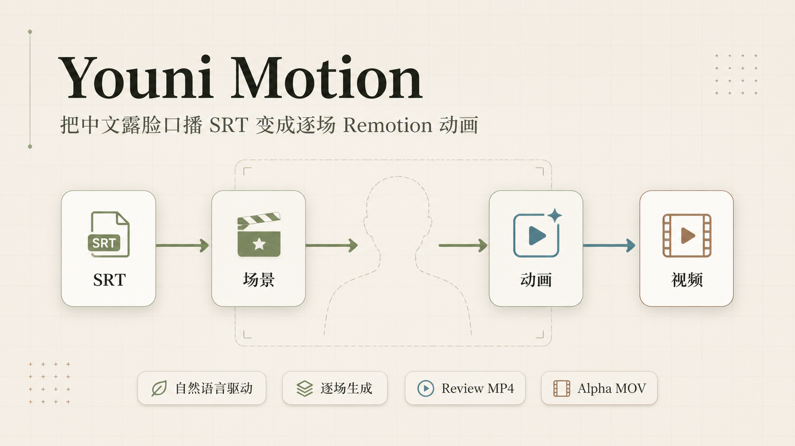
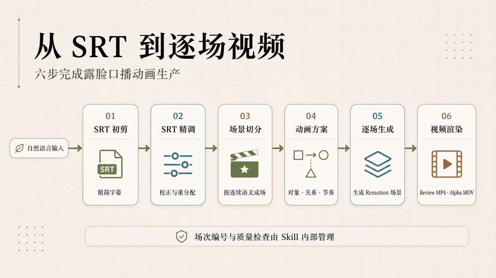
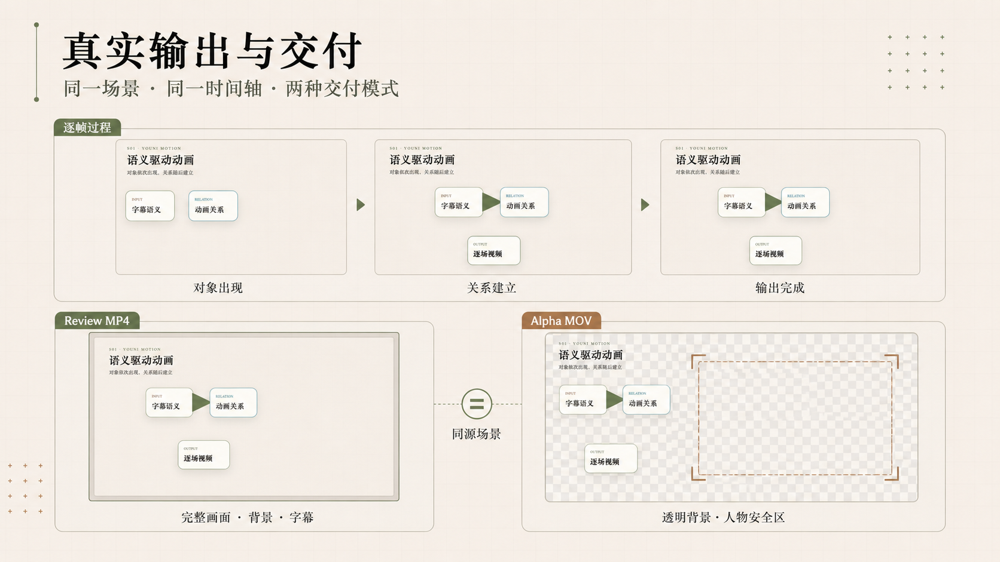
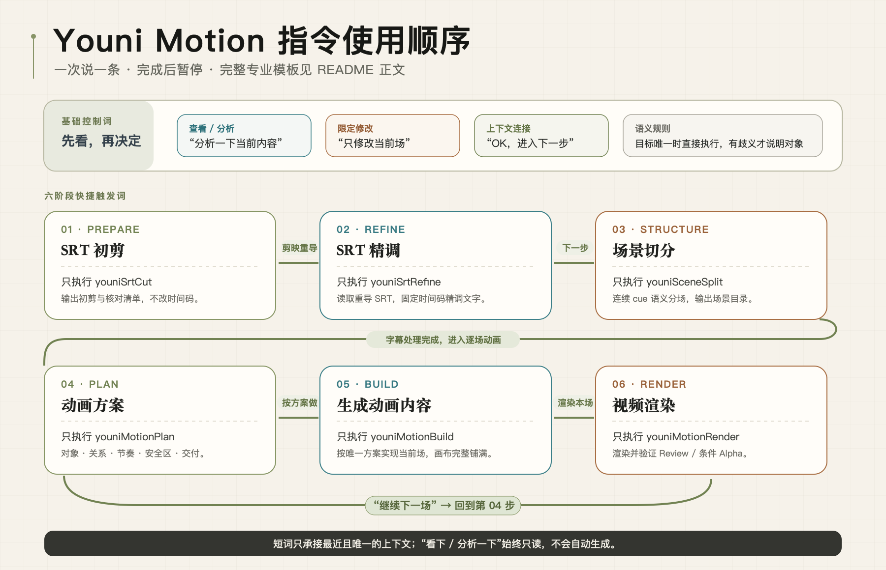

<p align="right"><a href="README.en.md">English</a> · 简体中文</p>

<p align="center">
  
</p>

<h1 align="center">Youni Motion</h1>

<p align="center"><strong>把中文露脸口播 SRT，变成可逐场确认、可持续修改、可直接叠加真人的 Remotion 动画。</strong></p>

<p align="center">
  <a href="https://github.com/laobaibaiya-alt/youni-motion/releases/tag/v0.1.0"></a>
  <a href="LICENSE"></a>
  
  
</p>

Youni Motion 是一套面向中文露脸口播的 Agent Skill。它以 SRT 为时间骨架，通过普通中文指令完成字幕初剪、字幕精调、场景切分、动画方案、逐场生成和视频渲染，交付完整画面的 Review MP4，以及为真人叠加保留安全区域的 Alpha MOV。

## 它解决什么问题

露脸口播动画不仅要“让元素动起来”，还要让字幕语义、物体出场、关系建立、人物位置和最终交付保持一致。Youni Motion 把这些要求放进同一套生产流程，让创作者可以用“分析当前场”“修改开头”“继续下一段”“渲染最后一场”这样的自然语言持续推进，而不用管理内部场次编号和质量凭据。



## 核心原则

- 用户可以说“分析当前场”“修改开头”“继续下一段”“渲染最后一场”，不需要填写内部场次编号、审批凭据或工作流状态。
- SRT 初剪和精调只修改文字，不改变任何已有时间码。
- 唯一匹配直接执行，真实歧义才提问。
- 中间场使用完整画布；开场、尾场和单场项目同时支持 Review MP4 与透明 MOV。
- 默认中央人物安全区域为 `x=690, y=108, width=540, height=760`，允许项目配置。

## 真实输出与交付

同一个场景实现会沿同一时间轴生成两种交付：Review MP4 保留完整背景和字幕，用于逐场确认；Alpha MOV 移除背景和字幕，并保留中央人物安全区域，用于后期叠加真人。



## 安装 Skill

把整个仓库复制到 Codex Skills 目录：

```bash
cp -R youni-motion ~/.codex/skills/youni-motion
```

之后可以用 `$youni-motion` 明确调用，也可以直接描述 SRT 口播动画任务触发。

## 中文指令怎么用

每次只发出一条指令。当前步骤完成并暂停后，先查看结果，再决定是否进入下一步。

基础控制词：

- `分析一下当前内容`：只读查看，不生成、不覆盖。
- `只修改当前场`：把修改范围限定在当前场景。
- `OK，进入下一步`：承接最近且唯一的上下文。

六个专业阶段可以按顺序逐条使用：

1. `使用 $youni-motion，先清理 SRT，完成后暂停。`
2. `使用 $youni-motion，精调当前 SRT，完成后暂停。`
3. `使用 $youni-motion，按语义切分场景，完成后暂停。`
4. `使用 $youni-motion，设计当前场动画方案，完成后暂停。`
5. `使用 $youni-motion，按方案生成当前场，完成后暂停。`
6. `使用 $youni-motion，渲染当前场视频，完成后暂停。`

进入逐场生产后，可以用短词继续：动画方案确认后说 `按这个方案做`，动画内容完成后说 `渲染本场`，当前场视频确认后说 `继续下一场`，流程会回到第 4 步。短词只承接最近且唯一的上下文；如果目标存在真实歧义，Skill 才会要求说明对象。



## 初始化最小项目

在仓库根目录执行：

```bash
node scripts/init_project.mjs ./youni-motion-demo --example
cd ./youni-motion-demo
npm install
```

`--example` 会加入一份完全虚构的六秒 SRT、场景目录和动画方案。去掉该参数则只创建干净模板。

项目默认结构：

```text
youni-motion-demo/
├── youni-motion.config.json
├── input/
├── docs/
├── public/source.srt
├── src/
├── scripts/
└── renders/
```

## 预览与渲染

```bash
npm run typecheck
npm run studio
npm run render:review
npm run render:alpha
```

- `render:review` 生成 `renders/S01/review.mp4`。
- `render:alpha` 生成 ProRes 4444 透明视频 `renders/S01/alpha.mov`。
- 两种输出使用同一 Composition 结构和时间轴；Alpha 模式不含背景和字幕。

检查交付文件：

```bash
npm run validate:delivery -- renders/S01/review.mp4 review
npm run validate:delivery -- renders/S01/alpha.mov alpha
```

## SRT 与方案工具

```bash
node scripts/validate_srt.mjs input/source.srt
node scripts/srt_apply_edits.mjs input/source.srt edits.json docs/srt/refined.srt
node scripts/validate_scene_catalog.mjs docs/scene-catalog.json
node scripts/validate_animation_plan.mjs docs/scene-plans/S01-animation-plan.json
```

`srt_apply_edits.mjs` 的 `edits.json` 是以 cue 编号为键、修订文字为值的 JSON 对象。脚本会拒绝不存在的 cue，并原样保留所有时间码。

## 配置

`youni-motion.config.json` 定义画布、帧率、场景、字幕文件和人物安全区域。v0.1.0 默认只承诺 1920 × 1080、30 fps、16:9 横屏。

## 当前发布状态

Youni Motion `v0.1.0` 已在 GitHub 公开发布。发布包结构、模板、脚本、公开示例、Apache-2.0 许可证和基础契约测试均已整理；独立目录中的 `npm ci`、TypeScript 类型检查、真实 Review MP4、ProRes Alpha MOV、透明通道、安全区域和隐私扫描已于 2026-08-25 通过。机器可读结果见 [Step 2 release QA](tests/reports/2026-08-25-step2-release-qa.json)。

## 许可证

Youni Motion 原创文件采用 Apache-2.0。Remotion 使用自己的特殊许可证，部分组织可能需要公司许可证；使用前请阅读 [DEPENDENCIES.md](DEPENDENCIES.md) 和 [Remotion License](https://github.com/remotion-dev/remotion/blob/main/LICENSE.md)。不要把 Remotion 许可证密钥提交到仓库。

本地包不会自动创建远程仓库、上传文件或发布 GitHub Release。
